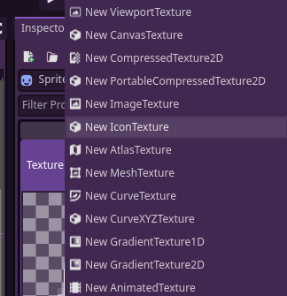

# Easy icons
Welcome and thanks for downloading my plugin

## Tutotial
After downloading and activating the plugin in the plugins tab of your project settings yo will first add any **Node** that has a property of type **Texture**, while adding a resource to that property you will see a new class, **IconTexture** right below **ImageTexture**
